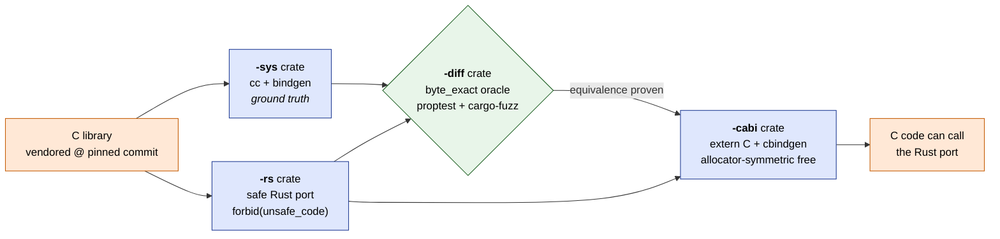

# Agentic C ↔ Rust Migration

## About

A practical workflow for **binding C and Rust together** and a **gentle on-ramp for C developers curious about Rust**. The playbook is one config block + ten phases with machine-checkable exit gates, runnable by an agentic CLI (Claude Code, Codex) or a human. Each migration produces a four-crate Cargo workspace: a `#![forbid(unsafe_code)]` safe core, a `bindgen`-backed reference oracle, a `byte_exact` differential proptest + fuzz harness, and an allocator-symmetric C ABI for calling Rust from existing C. **Status:** workflow-and-reproducibility demo — performance not yet tuned, line-by-line port comments pending (see [`ROADMAP.md`](./ROADMAP.md)).

Four worked examples ship alongside the playbook: it is applied to **two** real C libraries (`phoboslab/qoi`, `Cyan4973/xxHash`) by **two** different agentic CLIs (Claude Code, Codex). If anything below is unfamiliar, the [**Glossary**](./GLOSSARY.md) defines every term.

---

## What the workflow does, at a glance



Both FFI directions are covered (`-sys` inbound, `-cabi` outbound), so a C developer can introduce Rust **incrementally** — call Rust from C, call C from Rust, or both at once.

## Why a C developer might care

| Concern when leaving C | What the workflow gives you |
|---|---|
| "Will the Rust port behave identically to my existing C?" | A `byte_exact` differential oracle (proptest ≥1024 cases per property + ≥60 s of `cargo-fuzz`) that fails the build on any divergence. |
| "How much `unsafe` will I have to write?" | The safe core is `#![forbid(unsafe_code)]` — compile-enforced. All `unsafe` is in the two FFI boundary crates, with documented contracts. |
| "Will it be slow?" | Each example ships `criterion` microbenchmarks and a `hyperfine` whole-process race against C built with `-O3`. Numbers in the [results matrix](./runs/README.md). |
| "Can I still call this from my existing C code?" | Yes. The `-cabi` crate exposes `extern "C"` entries, a `cbindgen`-generated header, and an allocator-symmetric `*_rs_free` for owned-buffer returns. |
| "What if I get the FFI ownership wrong?" | The playbook bakes the "whoever allocates frees" rule in: `-sys` copies C-`malloc` results into an owned `Vec` and `libc::free`s the C pointer; `-cabi` returns `Box::into_raw`'d buffers reclaimed via `Box::from_raw` in `*_rs_free`. |

---

## What's in this repo

```
01 - Implementation/
├── README.md                                   you are here
├── GLOSSARY.md                                 every term defined
├── ROADMAP.md                                  what's missing and what's planned
├── .gitignore
├── playbook/
│   └── c-to-rust-migration-playbook.md         the agent-executable playbook
└── runs/
    ├── README.md                               cross-run results matrix
    ├── claude/
    │   ├── qoi.md            qoi-task.md       Claude Code × QOI:    report + agent prompt
    │   └── xxhash.md         xxhash-task.md    Claude Code × xxHash: report + agent prompt
    └── codex/
        ├── qoi.md            qoi-task.md       Codex × QOI:          report + agent prompt
        └── xxhash.md         xxhash-task.md    Codex × xxHash:       report + agent prompt
```

Each run is a pair of files: `<lib>.md` is the one-page report (description, filled config block excerpt, headline results, one snippet); `<lib>-task.md` is the exact prompt the agent received (the playbook with that library's config block filled in). The full Cargo workspaces aren't checked in — they're reproducible by feeding a `*-task.md` to the agent.

---

## How a single migration runs end to end

The workflow is built around one principle: **never trust a port you cannot differentially compare against the original.**

1. **Vendor** the upstream C verbatim at a pinned commit under `vendor/${LIB}/`.
2. **Expose the original through `-sys`** (`cc` + `bindgen`) — the ground truth the port is held to.
3. **Rewrite, don't transpile**, the algorithm in idiomatic, dependency-free Rust in the `-rs` core crate, `#![forbid(unsafe_code)]`.
4. **Prove equivalence in `-diff`** — assert the chosen relation (`byte_exact` for codecs/hashers) across ≥1024 proptest cases per property + ≥60 s of differential `cargo-fuzz`.
5. **Expose the port back to C through `-cabi`** with `extern "C"` entries, `#[repr(C)]` types, a `cbindgen` header, and allocator-symmetric `*_rs_free`.
6. **Measure the cost of safety** — `criterion` microbenchmarks + `hyperfine` whole-process race against C `-O3`.
7. **Lock reproducibility** — same upstream commit, pinned toolchain, recorded C flags, checked-in `Cargo.lock`.

Every phase ends in a machine-checkable exit gate. An agentic CLI follows the playbook with a per-library config block; a human can run the same gates manually.

---

## License & provenance

- **This playbook and the run reports**: MIT.
- **Vendored C sources** are referenced in each run's config block, never modified, and carry their upstream licenses: `phoboslab/qoi` is MIT, `Cyan4973/xxHash` (library files) is BSD-2-Clause. (Note: the `xxhsum` CLI in xxHash is GPL — do not vendor it.)

---

## See also

- [`GLOSSARY.md`](./GLOSSARY.md) — every term used in the workflow.
- [`playbook/c-to-rust-migration-playbook.md`](./playbook/c-to-rust-migration-playbook.md) — the actual workflow.
- [`runs/README.md`](./runs/README.md) — side-by-side results across the four reproductions.
- [`ROADMAP.md`](./ROADMAP.md) — explicit list of what this **isn't yet**.
