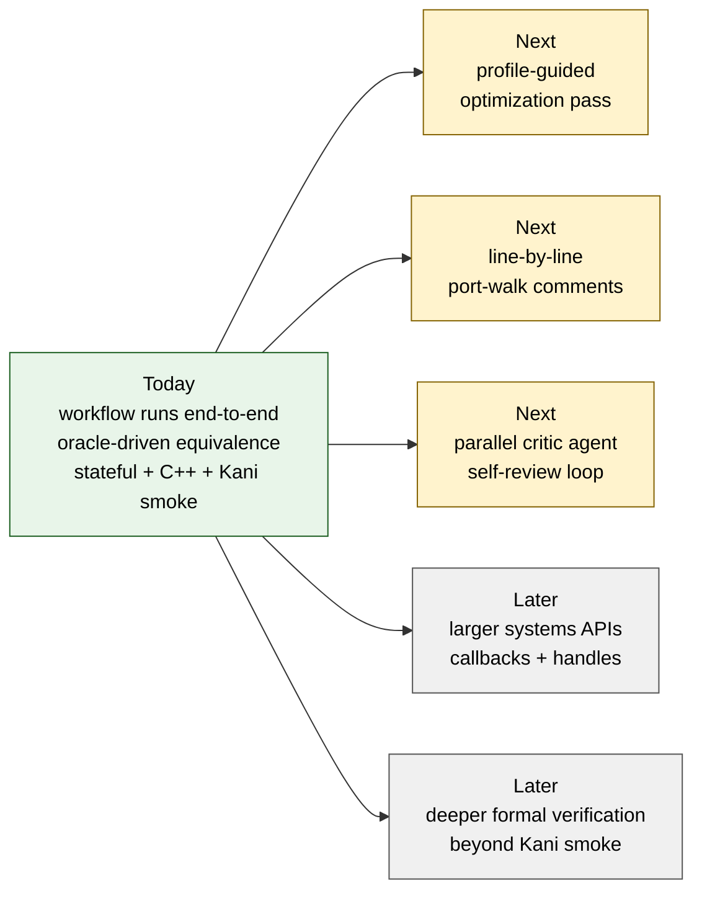

# Roadmap — what remains

A **recipe-and-reproducibility demo**, not a polished library. Calling that out so reviewers don't measure it against the wrong yardstick.

The original roadmap listed stateful APIs and formal verification as future
work. The current repo now includes Claude Code and Codex ring-buffer runs, plus
a Codex RE2 C++ interop run with Kani proof-smoke harnesses; this file tracks
what remains after those additions.

## Where the workflow is, and where it's going

## Completed since the original roadmap

| Item | Where |
|---|---|
| Stateful migration examples | [`runs/claude/ring-buffer.md`](./runs/claude/ring-buffer.md) and [`runs/codex/ring-buffer.md`](./runs/codex/ring-buffer.md) |
| C++ ownership interop example | [`runs/codex/re2-cpp.md`](./runs/codex/re2-cpp.md) and [`migrations/re2-cpp/codex/re2-cpp-rs-migration`](./migrations/re2-cpp/codex/re2-cpp-rs-migration/) |
| First Kani proof smoke | [`migrations/re2-cpp/codex/re2-cpp-rs-migration/FORMAL_VERIFICATION.md`](./migrations/re2-cpp/codex/re2-cpp-rs-migration/FORMAL_VERIFICATION.md) |

## Still not done (deliberate, on the list)

### 1. Performance optimization pass
The benchmarks measure **parity, not peak**. The Rust ports were written for correctness, safety, and readability against the spec — they were **not tuned**.

| Run | Current vs C `-O3` (hyperfine, whole-process) |
|---|---|
| Claude × QOI    | Rust ≈ 0.79× C (1.26× ± 0.10 slower) |
| Claude × xxHash | **Parity** (1.00× ± 0.05; safe `chunks_exact` path) |
| Codex  × QOI    | Rust ≈ 0.50× C (C 2.01× faster) |
| Codex  × xxHash | C 1.02× faster (within noise) |

**Planned next pass** (none of this has run yet):
- Profile each Rust port with `cargo flamegraph` / `samply`; identify the hot loop(s).
- Try safe Rust idioms known to elide bounds checks (`chunks_exact`, fixed-size arrays, `assert!`-hoisting) before reaching for `unsafe` — the Claude xxHash run already shows this is enough for hashers; QOI needs investigation.
- Only if those fail, scope a single `unsafe` block with a written safety contract, justified by a measured speedup, and gate it on `--feature unsafe-fast`.
- Land the wins as **playbook additions** (new phase / new gate), not as one-off tweaks.

### 2. Inline code commentary
The current Rust sources carry doc-comments on the public API, safety-contract comments on every `unsafe` block, and per-test rationale in the proptest generators. They do **not** carry the line-by-line "this mirrors C function X around line Y" annotations a reader would need to follow the port against the reference. That's a reviewer-facing improvement, not a correctness one — the differential oracle is what proves the port is faithful.

**Planned next pass**: write a "port walk" — `// REF: path/to/reference:L###` markers on each non-trivial Rust block pointing to the corresponding C/C++ source, plus a short prose section in each `lib.rs` explaining the important semantic mirroring (integer wrapping, ownership transfer, state transitions, and similar details). This is the change most likely to help a C or C++ developer trust the port.

### 3. Parallel critic agent for self-review
Each run is executed by a single agent. Wiring a parallel critic agent into the playbook (e.g. after Phase 4: a second agent reviews the port, runs the oracle, files a fix) is the natural next step.

### 4. Larger / harder libraries
QOI is ~300 LOC, single-header, deterministic. xxHash one-shot is ~250 LOC, pure function. The follow-on reports add small stateful ring-buffer runs and a C++ RE2 ownership facade. The next step is larger systems-shaped APIs: callbacks, larger opaque-handle APIs, streaming parsers, or allocator-heavy libraries.

### 5. Deeper formal verification
The RE2 C++ interop run includes a first Kani proof smoke over core invariants. The remaining gap is deeper verification on a richer pure core, or a Creusot/Kani phase that proves more than bounded no-panic and simple lifecycle invariants.

## Working as intended (not on the roadmap)

- `#![forbid(unsafe_code)]` on the safe core, compile-enforced.
- All `unsafe` confined to the two FFI crates (`-sys`, `-cabi`) with documented contracts.
- Vendor everything at pinned commits; commit `Cargo.lock`; record C flags.
- Use the strongest practical oracle relation: `byte_exact` where output is uniquely defined, `model_based` for stateful APIs, and `behavioral` where full equivalence is not tractable.

These are load-bearing choices, not gaps.
