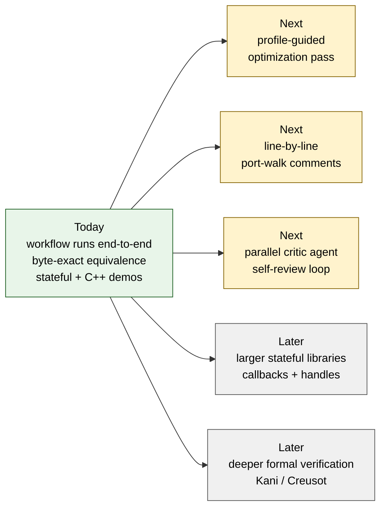

# Roadmap — what this is not yet

A **recipe-and-reproducibility demo**, not a polished library. Calling that out so reviewers don't measure it against the wrong yardstick.

## Where the workflow is, and where it's going

## Not done (deliberate, on the list)

### 1. Performance optimization pass
The benchmarks measure **parity, not peak**. The Rust ports were written for correctness, safety, and readability against the spec — they were **not tuned**.

| Run | Current vs C `-O3` (hyperfine, whole-process) |
|---|---|
| Claude × QOI    | Rust ≈ 0.79× C (1.26× ± 0.10 slower) |
| Claude × xxHash | **Parity** (1.00× ± 0.05; safe `chunks_exact` path) |
| Codex  × QOI    | Rust ≈ 0.50× C (C 2.01× faster) |
| Codex  × xxHash | C 1.02× faster (within noise) |

**Planned next pass** (none of this has run yet):
- Profile each Rust port with `cargo flamegraph` / `samply`; identify the hot loop(s).
- Try safe Rust idioms known to elide bounds checks (`chunks_exact`, fixed-size arrays, `assert!`-hoisting) before reaching for `unsafe` — the Claude xxHash run already shows this is enough for hashers; QOI needs investigation.
- Only if those fail, scope a single `unsafe` block with a written safety contract, justified by a measured speedup, and gate it on `--feature unsafe-fast`.
- Land the wins as **playbook additions** (new phase / new gate), not as one-off tweaks.

### 2. Inline code commentary
The current Rust sources carry doc-comments on the public API, safety-contract comments on every `unsafe` block, and per-test rationale in the proptest generators. They do **not** carry the line-by-line "this mirrors C function X around line Y" annotations a reader would need to follow the port against the reference. That's a reviewer-facing improvement, not a correctness one — the differential oracle is what proves the port is faithful.

**Planned next pass**: write a "port walk" — `// REF: qoi.h:L###` markers on each non-trivial Rust block pointing to the corresponding C, plus a short prose section in each `lib.rs` explaining the integer-arithmetic mirroring (`u8::wrapping_sub(..) as i8`, etc.). This is the change most likely to help a C developer trust the port.

### 3. Parallel critic agent for self-review
Each run is executed by a single agent. Wiring a parallel critic agent into the playbook (e.g. after Phase 4: a second agent reviews the port, runs the oracle, files a fix) is the natural next step.

### 4. Larger / harder libraries
QOI is ~300 LOC, single-header, deterministic. xxHash one-shot is ~250 LOC, pure function. They were chosen because they let the **oracle** be byte-exact and the **port** finish in one pass. The follow-on Codex reports now add a small stateful ring buffer and a C++ RE2 ownership facade, so the next demo should move beyond "small but stateful" into callbacks, larger opaque-handle APIs, streaming parsers, or allocator-heavy libraries.

### 5. Formal verification path
Differential fuzzing covers a lot, but it isn't a proof. The RE2 C++ interop run includes a first Kani proof smoke over core invariants; the next step is deeper verification on a richer pure core, or a Creusot/Kani phase that proves more than bounded no-panic and simple lifecycle invariants.

## Working as intended (not on the roadmap)

- `#![forbid(unsafe_code)]` on the safe core, compile-enforced.
- All `unsafe` confined to the two FFI crates (`-sys`, `-cabi`) with documented contracts.
- Vendor everything at pinned commits; commit `Cargo.lock`; record C flags.
- `byte_exact` over `behavioral` wherever the C output is uniquely defined.

These are load-bearing choices, not gaps.
