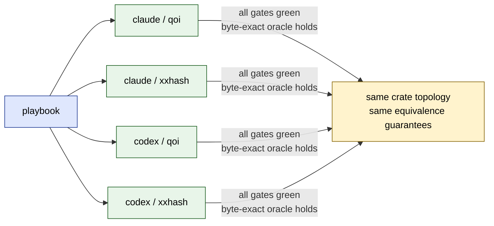

# Runs — cross-reproduction results matrix

The original matrix contains four reproductions of the same [playbook](../playbook/c-to-rust-migration-playbook.md): **two agentic CLIs x two C libraries**. Additional Codex runs extend the coverage to a stateful C API and a C++ RAII interop component. Each run is distilled to a single page; headline details come from the generated workspace reports, notes, and verification files.

Each run ships as two files side by side:

- **`<lib>.md`** — the report: brief description, filled config block, headline results, one relevant snippet.
- **`<lib>-task.md`** — the **exact prompt the agent received**, i.e. this repo's [playbook](../playbook/c-to-rust-migration-playbook.md) with the config block at the top filled in for that library. Read one of these if you want to see what an end-to-end agent instruction for this workflow concretely looks like.

## At a glance

| Run (report → task) | Library | Upstream pin | License | Agent | Bench (C `-O3` vs Rust `--release`, whole-process) | `unsafe` |
|---|---|---|---|---|---|---|
| [`claude/qoi.md`](./claude/qoi.md) → [task](./claude/qoi-task.md)       | phoboslab/qoi   | `97bacc86…0b9`           | MIT          | Claude Code | C **1.26× ± 0.10** faster | 0 core; 2 + 3 FFI |
| [`claude/xxhash.md`](./claude/xxhash.md) → [task](./claude/xxhash-task.md) | Cyan4973/xxHash | `v0.8.3` (`e626a72…363`) | BSD-2-Clause | Claude Code | **Parity** (1.00× ± 0.05) | 0 core; 2 + 2 FFI |
| [`codex/qoi.md`](./codex/qoi.md) → [task](./codex/qoi-task.md)         | phoboslab/qoi   | `97bacc86…0b9`           | MIT          | Codex       | C **2.01×** faster (10.1 ms vs 20.4 ms) | 0 core; 2 + 9 FFI |
| [`codex/xxhash.md`](./codex/xxhash.md) → [task](./codex/xxhash-task.md)   | Cyan4973/xxHash | `v0.8.3` (`e626a72…363`) | BSD-2-Clause | Codex       | C **1.02×** faster (within noise)       | 0 core; 2 + 12 FFI |

Every run reports: **zero mismatches; no port bug found after initial implementation.** That's the recipe working — the agent writes against a spec while the oracle holds it to byte-for-byte equality with the reference.

## Verification depth (so you can judge the equivalence claim)

| Run | Golden vectors | Proptest cases | Fuzz |
|---|---|---|---|
| `claude/qoi`    | 10 | 9 props × 2048 + 6,591-case boundary grid | 122 s, **362,286** execs, 0 crashes |
| `claude/xxhash` | 75 + 2 canonical | 3 props × 2048 + 130×5 boundary sweep   | 122 s, **18,711,247** execs, 0 crashes |
| `codex/qoi`     | 6  | 2048                                     | 122 s, **2,226,427** execs, 0 crashes |
| `codex/xxhash`  | 12 | 2048                                     | 122 s, **52,675,307** execs, 0 crashes |

## Follow-on coverage

| Run (report -> task) | What it adds | Oracle / verification |
|---|---|---|
| [`codex/ring-buffer.md`](./codex/ring-buffer.md) -> [task](./codex/ring-buffer-task.md) | Stateful C API with caller-provided storage, overwrite-on-full behavior, and observable state transitions | `model_based` oracle comparing C and Rust after each generated operation; property tests, fuzz targets, benchmarks, and CI included |
| [`codex/re2-cpp.md`](./codex/re2-cpp.md) -> [task](./codex/re2-cpp-task.md) | C++ RAII ownership facade around non-copyable, non-movable `re2::RE2` | `behavioral` oracle over bounded literal matching; Docker validation, fuzz smoke, and Kani proof smoke completed |

## What's interesting

- **The workflow is agent-agnostic.** Two different CLIs, same playbook, same two libraries → four self-contained workspaces with the same crate topology and the same equivalence guarantees. Performance numbers differ; correctness gates do not.
- **Safe Rust can reach parity.** Claude's xxHash run hits parity with C `-O3` using only safe idioms (`chunks_exact` + fixed-size arrays). QOI ports — neither tuned — sit at 0.5–0.8× C. That gap is the obvious next optimization pass (see [ROADMAP](../ROADMAP.md)).
- **`unsafe` accounting is consistent.** The safe core is `#![forbid(unsafe_code)]` in all four runs (compile-enforced). All `unsafe` is in the two FFI crates, each block with a documented contract.
